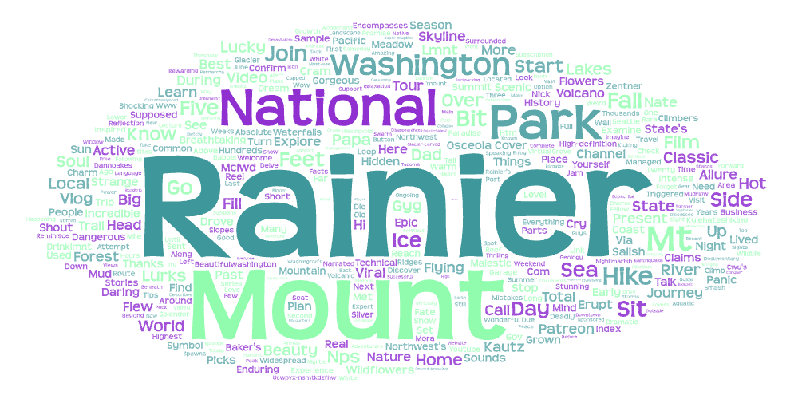
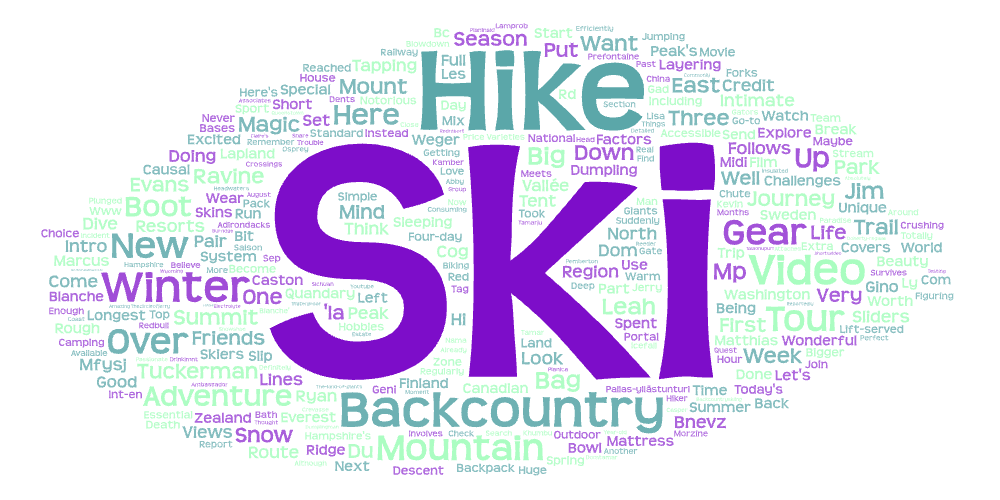

# Using Word Clouds to Compare Narratives

## Lab 2 
This lab shows us how outdoor keywords tell us about online narratives. This lab is comparing two word clouds generated from separate keyword searches. The first word cloud uses keywords “Mountain” and “Rainier”, while the second uses “Hiking” and “Skiing.” The most frequently used words in each dataset will hopfeully help show similarities and differences in how poeple see Mount Rainier and recreational activities.

---

## Topic and Parameters
The topic of this research is **Mount Rainier and its relation to recreational activies**, how people describe places vs activities.

- **Word Cloud 1 - Mountain & Rainier**  
  The word cloud uses the keywords "Mountain" and "Rainier" which portray highly frequent words in the world cloud such as park, Washington, national, nature, which relate to the place.

- **Word Cloud 2 - Hiking & Skiing**  
  The word cloud uses the keywords hiking and skiing which portray highly frequent words in the world cloud such as Winter, Season, Summer, explore, adventure, backcountry, which relate to the recreational activities and experiences.

---

## Why make this comparison?
The reason I made this comparison is to understand why place keywords differ from activity keywords. For example,  mountains are often seen for their imagery, geography, and natural beauty, whereas activities like hiking and skiing are more likely to be about personal experience, skill level. Comparing these word clouds helps portray how people see nature vs recreation.

---

## Word Clouds Comparsion
The word cloud for Mountain & Rainier displays big words such as National Park, Washington, beauty, scenic, and nature. These words support that location, tourism, and visual appreciation are thought about more.

Like said above, Hiking and Skiing word cloud includes words like backcountry, winter, summer, trail, snow, and adventure. This is a more adventure based narrative which focuses on physical activity, seasons, and weather conditions.

---

## Reasons for Patterns
The reason for these patterns are because Mount Rainier is a famous landmark often talked about for it's tourism, natural beauty, and geography. And mountains are oftently connected to recreactional activities.

---

## How Research Could Be Improved
This research could be improved by:
- Largening the data set.
- Separate seasonal data into Winter, Spring, Fall, and Summer.
- Comparing more keywords.

---

## Suprising Results
One surprising thing from the data was how much more seasonal terms were in the hiking and skiing word cloud compared to the Mount Rainier cloud. I expected more similarities in words between the two datasets, but the results clearly show us that people talk about places and activities in different ways.

---

## Word Clouds

### Mountain & Rainier Word Cloud

### Hiking & Skiing Word Cloud

---

## Download Datasets
The processed datasets used to generate these word clouds can be downloaded here:

**CSV's:**  

  https://github.com/PhilipKleemann/geog458_lab2/assests/search-result-1.csv

   https://github.com/PhilipKleemann/geog458_lab2/assests/search-result-2.csv

